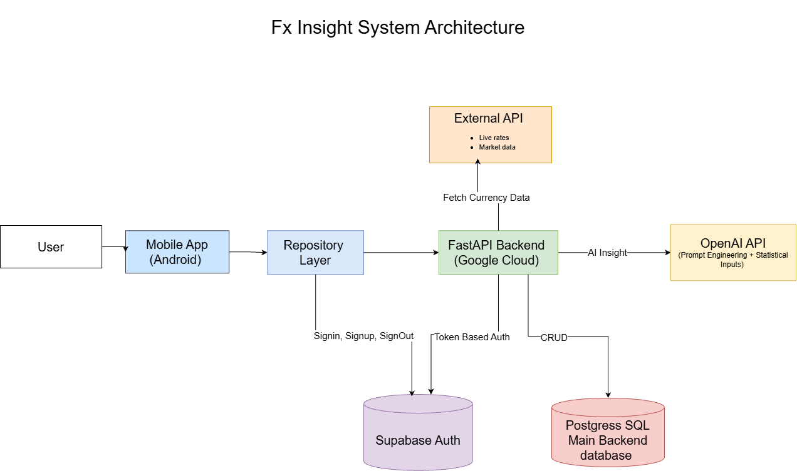

# FX Insight

FX Insight is a full-stack Android application for real-time currency conversion, market trend analysis, and user-focused financial tracking. It was built as a portfolio project to demonstrate Android development, backend integration, cloud deployment, security practices, and practical AI-assisted features in a polished product experience.

## Overview

The application allows users to convert currencies, save favorite currency pairs, review conversion history, create exchange-rate alerts, and explore short-term market movement through charting, summary statistics, and lightweight AI-generated insight. The project focuses on engineering quality, cloud-backed architecture, and real-world product design rather than financial prediction or trading functionality. 

## Features

- User authentication and persistent session handling
- Real-time currency conversion
- Currency pair swapping
- Favorite pair management
- Conversion history tracking
- Rate alert creation and monitoring
- Historical market analysis
- AI-generated market summaries
- Cloud-based backend deployment
- Secure secret and credential handling

## Screenshots

| Login | Dashboard |
|---|---|
|  |  |

| Market Graph | Market AI Insight |
|---|---|
|  |  |

| History | Profile |
|---|---|
|  |  |

## Tech Stack

### Android
- Kotlin
- Jetpack Compose
- ViewModel
- StateFlow
- Coroutines
- Retrofit

### Backend and Cloud
- FastAPI
- PostgreSQL
- Supabase Auth
- Google Cloud Run
- Google Secret Manager

### Data and Features
- Exchange rate API integration
- Alert workflow
- AI-generated insight layer 

## System Architecture

## Core Functionality

### Authentication
Users can sign up, sign in, and access user-specific data through authenticated flows.

### Currency Conversion
The app supports real-time conversion between currencies, live result updates, and swap functionality between base and target currencies.

### Favorites
Users can save commonly used currency pairs and quickly reuse them from the dashboard.

### History
The application stores previous conversions so users can review past activity and reuse old records.

### Alerts
Users can create rate alerts for selected currency pairs and monitor triggered alerts from within the app.

### Market Analysis
The app includes historical charting, daily change summaries, and weekly statistics such as high, low, average, and median values.

### AI Insight
FX Insight includes a lightweight AI-generated market summary feature. Instead of relying only on raw prompting, it uses structured numerical inputs such as daily change, weekly trend, high, low, average, and median to generate more grounded and relevant summaries. This feature is designed for explanation and context, not financial advice or prediction. 

## Architecture Choice

One of the most valuable lessons from building FX Insight was comparing backend infrastructure options for different project sizes.

For early-stage products, MVPs, or smaller freelance apps, Supabase is often a practical choice because it combines PostgreSQL, authentication, and backend-related features in one platform with lower setup complexity. This makes it attractive when development speed, simpler infrastructure, and lower entry cost matter.

Compared with Firebase, Supabase was a better fit for this project because it is built around a relational SQL model. That makes structured data, relationships, and long-term database organization easier to manage for an application with user profiles, favorites, conversion history, and alerts. Firebase is powerful for rapid development and real-time use cases, but its NoSQL model is not always the best match for apps that benefit from relational queries and more traditional database design.

For this kind of application, a practical architecture choice is Supabase for the database and authentication layer, combined with Cloud Run for custom backend deployment. This provides the flexibility of a deployable backend while keeping the data layer simpler and more cost-conscious during the early stage of development. As infrastructure demands grow, a more fully managed cloud database architecture can become more appropriate. 
## Security Highlights

This project reinforced the importance of verifying JWTs on authenticated HTTP requests rather than relying only on client-side session state. It also provided practical experience in separating end-user authentication from backend infrastructure authorization.

Sensitive values such as database credentials and API keys were stored in Google Secret Manager and attached to the deployed backend through controlled IAM permissions. The project also involved working with service accounts for backend deployment and cloud resource access, helping strengthen secure deployment practices in Google Cloud. 

## Data Source Attribution

FX Insight uses the Frankfurter API for exchange rate data, including conversion and historical market information. The Android frontend, backend integration, alert workflow, cloud deployment, and AI summary layer were implemented as part of the project’s overall system design. 

## Future Improvements

- Better search and filtering for currencies
- Improved chart interactions
- Notification delivery for triggered alerts
- Additional profile and account settings
- UI polish and consistency improvements
- Expanded testing coverage
- Continued infrastructure refinement based on project scale and requirements 

## Author

Shawn Kitagawa