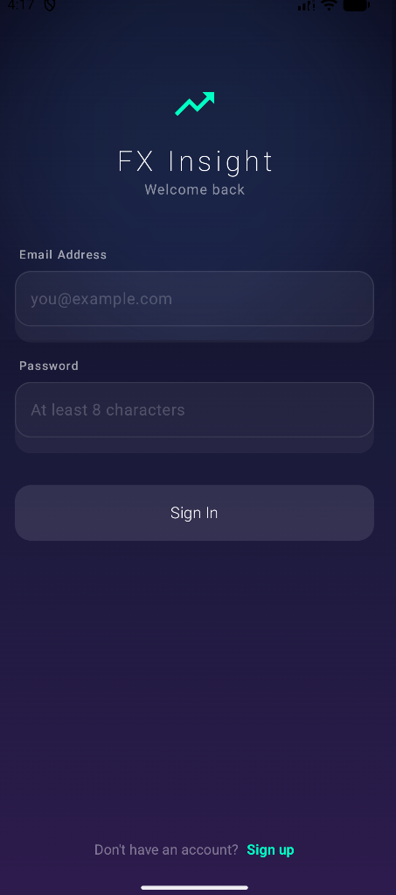
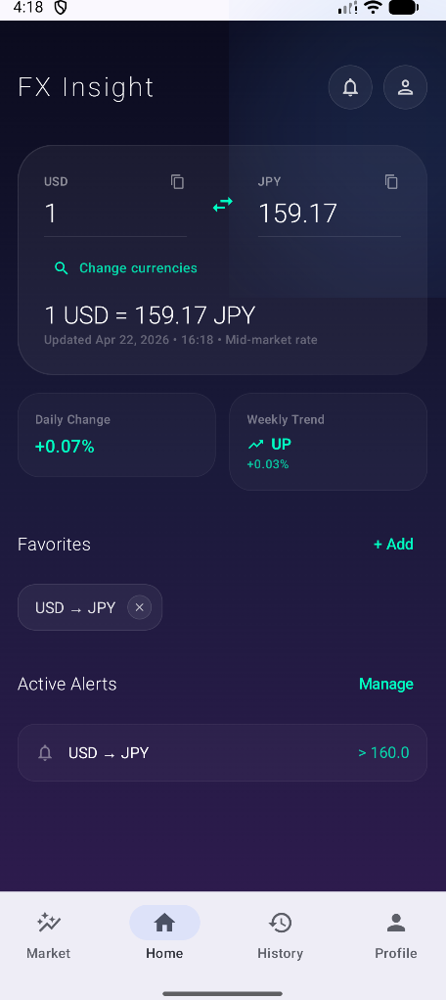
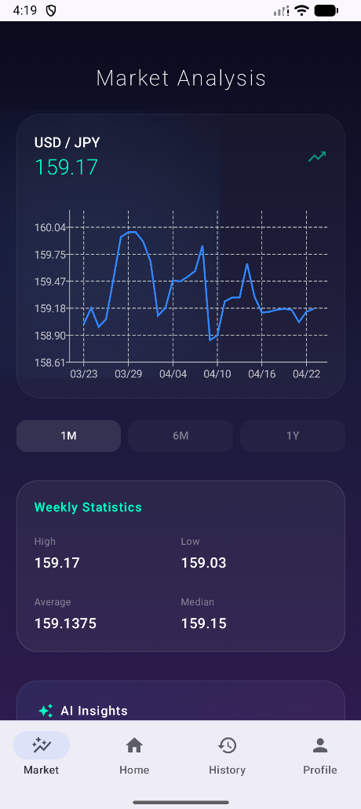
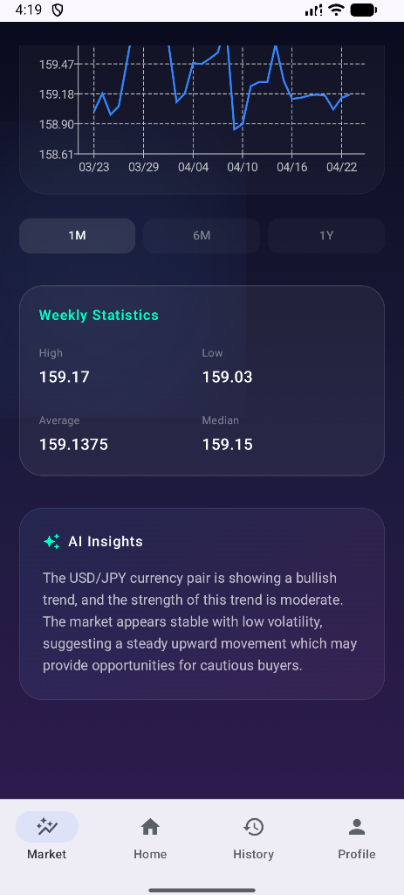
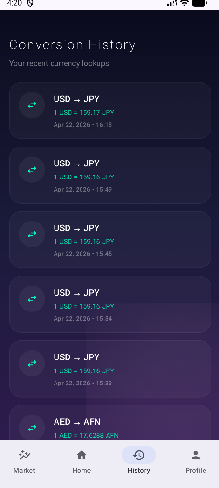
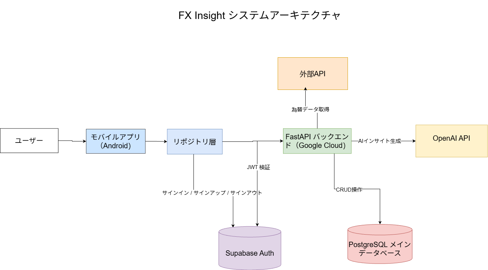

# FX Insight

FX Insight は、リアルタイム為替換算、市場トレンド分析、ユーザー向けの金融データ管理を行うフルスタック Android アプリケーションです。  
このプロジェクトは、Android 開発、バックエンド連携、クラウドデプロイ、セキュリティ設計、そして実用的な AI 補助機能を、ひとつのアプリケーションとして統合して示すことを目的としたポートフォリオ作品です。

## 概要

このアプリでは、通貨換算、お気に入り通貨ペアの保存、換算履歴の確認、為替アラートの作成、そしてチャート・要約統計・軽量な AI 生成インサイトを通じた短期的な市場動向の確認ができます。  

本プロジェクトは、金融予測やトレード機能そのものではなく、アプリケーション設計、エンジニアリング品質、クラウド構成、セキュリティを重視して開発しました。

## 主な機能

- ユーザー認証とセッション保持
- リアルタイム為替換算
- 通貨ペアの入れ替え
- お気に入り通貨ペア管理
- 換算履歴の保存・再利用
- 為替アラートの作成と監視
- 過去レートを用いた市場分析
- AI によるマーケット要約
- クラウド環境へのバックエンドデプロイ
- シークレット情報の安全な管理

## スクリーンショット

| ログイン | ダッシュボード |
|---|---|
|  |  |

ログイン画面では、ユーザー認証とセッション開始を行います。  
ダッシュボードでは、為替換算、保存済み通貨ペア、アラート情報をまとめて確認できます。

| マーケットグラフ | マーケットAIインサイト |
|---|---|
|  |  |

マーケットグラフ画面では、過去レートの推移や統計情報を視覚的に確認できます。  
マーケットAIインサイト画面では、数値データをもとに生成された市場要約を確認できます。

| 履歴 | プロフィール |
|---|---|
|  |  |

履歴画面では、過去の換算結果を一覧で確認し、再利用できます。  
プロフィール画面では、ユーザー情報の確認やサポート導線、サインアウト操作を行えます。

## 技術スタック

### Android
- Kotlin
- Jetpack Compose
- ViewModel
- StateFlow
- Coroutines
- Retrofit

### バックエンド / クラウド
- FastAPI
- PostgreSQL
- Supabase Auth
- Google Cloud Run
- Google Secret Manager

### データ / 機能
- 為替レート API 連携
- アラート機能
- AI インサイト生成機能 

## システム構成図

## コア機能

### 認証
ユーザーはサインアップ・サインインを行い、認証済みユーザーごとのデータにアクセスできます。

### 為替換算
リアルタイムで通貨換算を行い、換算結果を即時に更新できます。ベース通貨とターゲット通貨の入れ替えにも対応しています。

### お気に入り
よく使う通貨ペアを保存し、ダッシュボードからすぐに再利用できます。

### 履歴
過去の換算結果を保存し、後から確認したり再利用したりできます。

### アラート
指定した通貨ペアに対してレートアラートを作成し、条件に達したアラートをアプリ内で確認できます。

### マーケット分析
過去データのチャート表示に加え、日次変動、週次の高値・安値・平均・中央値などの統計情報を表示します。

### AI インサイト
FX Insight には、軽量な AI によるマーケット要約機能があります。  
単純なプロンプト入力だけではなく、日次変動、週次トレンド、高値、安値、平均、中央値といった構造化された数値情報をもとに要約を生成することで、より根拠のある説明を目指しています。  

この機能は、投資助言や価格予測ではなく、市場状況の理解を補助するためのものです。

## アーキテクチャ選定

FX Insight の開発を通して、アプリの規模に応じたバックエンド構成の選び方を比較・検討できたことは大きな学びでした。

初期段階のプロダクト、MVP、小規模なフリーランス案件では、Supabase は非常に実用的な選択肢です。  
PostgreSQL、認証、バックエンド関連機能をひとつのプラットフォームでまとめて扱えるため、構築の複雑さを抑えながら開発を進めやすいという利点があります。

Firebase と比較すると、このプロジェクトでは Supabase のほうが適していました。  
その理由は、Supabase がリレーショナルな SQL ベースの設計に向いており、ユーザープロフィール、お気に入り、換算履歴、アラートのような構造化データや関連データを扱いやすいためです。  
Firebase はリアルタイム性や高速な開発に強みがありますが、リレーショナルな問い合わせや、より伝統的なデータベース設計が必要なケースでは、Supabase のほうが扱いやすい場面があります。

また、Cloud SQL を直接利用する構成と比べると、Supabase は小規模プロジェクトにおいて、導入コストと運用負荷を抑えやすいという利点があります。  
一方で、より高度なインフラ制御、Google Cloud との密な統合、厳密なサービス分離が必要になってくる場合には、より本格的なマネージドデータベース構成が適する可能性があります。

この種のアプリケーションでは、データベースと認証に Supabase を使い、カスタムバックエンドのデプロイ先として Cloud Run を使う構成は、柔軟性とコストのバランスが取りやすい現実的な選択だと考えました。 

## セキュリティ面での学び

このプロジェクトでは、クライアント側のセッション状態だけに依存するのではなく、認証付き HTTP リクエストごとに JWT を検証する重要性を学びました。  
また、エンドユーザーの認証と、バックエンドインフラ側の認可を分けて考える実践的な経験も得られました。

データベース認証情報や API キーなどの機密情報は Google Secret Manager に保存し、IAM 権限を通じてバックエンドへ安全に接続しました。  
さらに、バックエンドのデプロイやクラウドリソースへのアクセスにサービスアカウントを利用することで、Google Cloud 上での安全なデプロイ構成について理解を深めました。 

## データソース

FX Insight では、為替換算や過去レート取得のために Frankfurter API を利用しています。  
Android フロントエンド、バックエンド統合、アラート機能、クラウドデプロイ、AI 要約機能は、本プロジェクトのシステム設計の一部として独自に実装しました。

## 今後の改善案

- 通貨検索・フィルタ機能の改善
- チャート操作性の向上
- 発火したアラートの通知機能
- プロフィールやアカウント設定の拡張
- UI 全体の統一感と完成度の向上
- テストの拡充
- プロジェクト規模に応じたインフラ構成の継続的な見直し 

## Author

Shawn Kitagawa