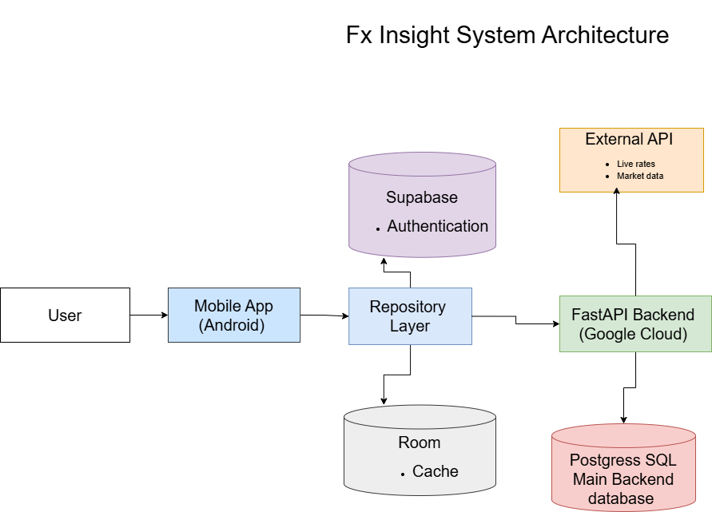
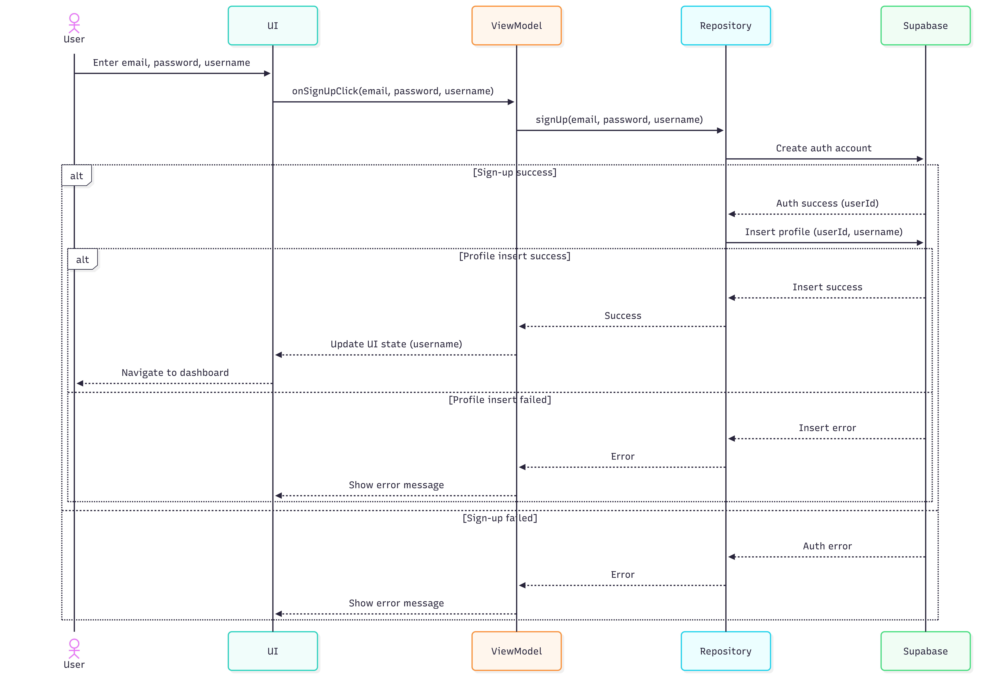
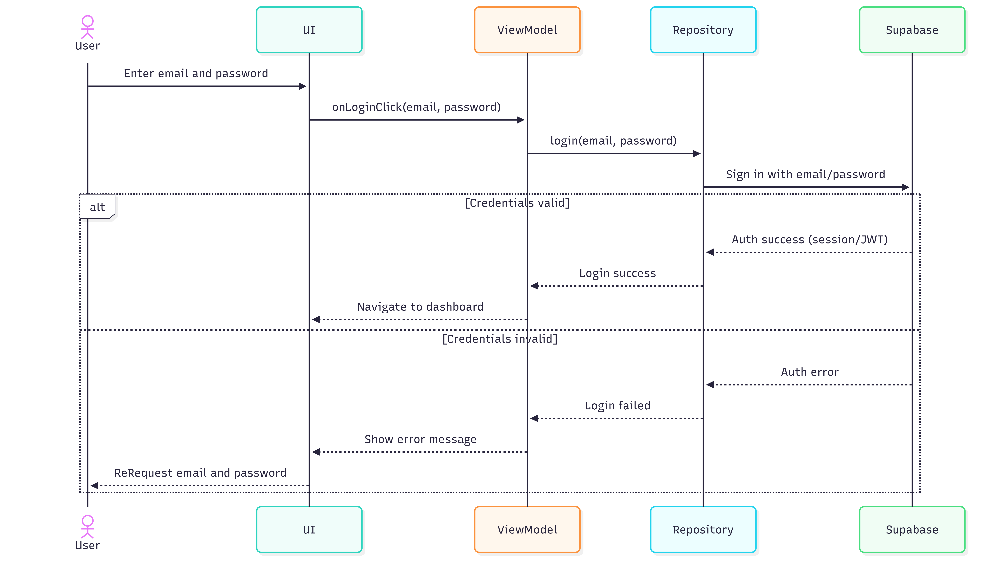
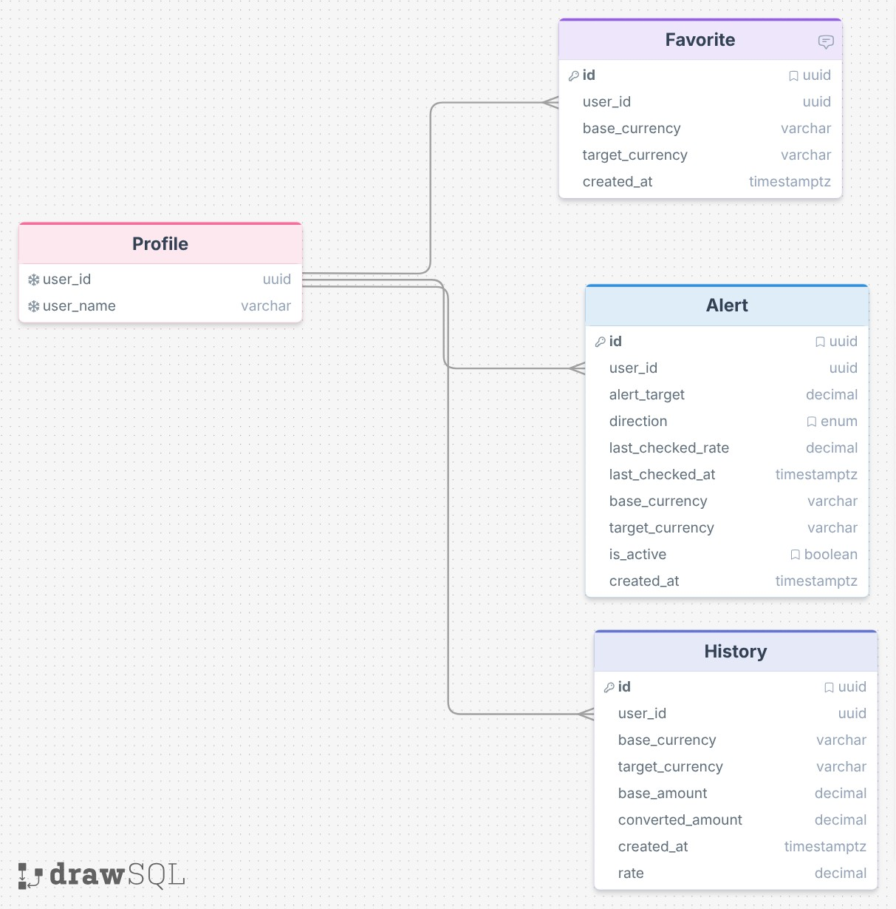

# FX Insight

FX Insight is a full-stack Android application for real-time currency conversion, trend analysis, and user-focused financial tracking. It was built as a portfolio project to demonstrate mobile development, backend integration, cloud deployment, security practices, and practical AI-assisted features in a polished product experience.

## Overview

The app allows users to convert currencies, save favorite pairs, review conversion history, create alerts, and explore short-term market movement through charting, summary statistics, and lightweight AI-generated insight.

This project focuses on product structure, engineering workflow, deployment, and security rather than financial prediction or trading functionality.

## Screenshots

- Login
- Dashboard
- Market Analysis
- History
- Profile

## Core Features

### Authentication
- User sign up and sign in
- Persistent session handling
- User-specific data access

### Currency Conversion
- Real-time currency conversion
- Swap between base and target currencies
- Live result updates
- Conversion timestamp display

### Favorites
- Save commonly used currency pairs
- Reuse saved pairs from the dashboard
- Remove saved favorites

### History
- Store previous conversions
- Review past activity
- Reuse conversion records

### Alerts
- Create rate alerts for selected currency pairs
- Track active alerts
- Surface triggered alerts on the dashboard

### Market Analysis
- Historical chart display
- Daily change summary
- Weekly statistics including high, low, average, and median
- Trend direction indicators

### AI Insight
- Lightweight AI-generated market summary
- Uses prompt engineering based on structured numerical inputs rather than raw prompting alone
- Incorporates multiple statistics such as daily change, weekly trend, high, low, average, and median to produce more grounded and relevant summaries
- Designed for explanation and context, not financial advice or prediction

## Architecture

## System Flow

### Sign Up

### Sign In

### Data Flow and Caching Strategy

## Entity Relationship Diagram

## Tech Stack

### Android
- Kotlin
- Jetpack Compose
- ViewModel
- StateFlow
- Coroutines
- Retrofit

### Backend and Cloud
- FastAPI
- PostgreSQL
- Supabase Auth
- Google Cloud Run
- Google Secret Manager

### Data and Features
- Exchange rate API integration
- Alert workflow
- AI-generated insight layer

## Database Design

### profiles
- user_id
- username
- created_at

### conversion_history
- id
- user_id
- amount
- base_currency
- target_currency
- exchange_rate
- converted_amount
- created_at

### favorite_pairs
- id
- user_id
- base_currency
- target_currency
- created_at

## Project Goals

This project was built to demonstrate:

- End-to-end Android application development
- Backend API integration in a real mobile workflow
- State-driven UI design with Compose
- Authenticated user features
- Cloud deployment and environment configuration
- Practical handling of conversion logic, alerts, charts, and AI summaries

## Engineering Focus

Key areas explored during development:

- API communication and error handling
- Compose state management
- Numeric precision and formatting
- Input synchronization in interactive UI
- Mobile and backend integration across real user flows
- Deployment configuration and secret management
- Real-world debugging across Android, backend, and cloud infrastructure

## Deployment Notes

One of the most useful lessons from building FX Insight was comparing infrastructure choices for smaller and larger applications.

For early-stage products, MVPs, or smaller freelance apps, Supabase can be a practical option because it combines PostgreSQL, authentication, and backend-related features in a single platform with lower setup complexity. Supabase offers a free tier and paid plans, which makes it attractive for small projects where keeping infrastructure simple matters. :contentReference[oaicite:0]{index=0}

Cloud SQL becomes more compelling when a project needs stronger control over database configuration, tighter Google Cloud integration, stricter infrastructure separation, or a more traditional managed database architecture. Google notes that Cloud SQL pricing depends on compute, memory, storage, and networking, and that the lowest-cost shared-core configurations are intended primarily for development and testing workloads. :contentReference[oaicite:1]{index=1}

A practical takeaway from this project is that Supabase often makes more sense for small freelance apps or MVPs because it reduces setup complexity and entry cost, while Cloud SQL makes more sense once the system grows into a more infrastructure-heavy backend with stricter operational requirements.

## Cost Considerations

One of the main lessons from this project was understanding that the cheapest database choice depends more on product stage and operational needs than on one exact user threshold.

For smaller apps, prototypes, or early freelance work, Supabase is often the more efficient choice because it lowers setup overhead while still providing PostgreSQL and authentication in one platform. :contentReference[oaicite:2]{index=2}

Cloud SQL can become a stronger option for more controlled, cloud-integrated, and infrastructure-heavy systems, but it usually introduces more setup and operational cost than a lightweight Supabase-backed app. Google’s pricing model reflects this by charging separately for instance resources, storage, and related usage. :contentReference[oaicite:3]{index=3}

## Security and Deployment Lessons

A major strength developed through this project was backend and cloud security handling.

This project reinforced the importance of verifying JWTs on authenticated HTTP requests rather than relying only on client-side session state. It also gave me practical experience separating user-level authentication from backend infrastructure authorization.

Sensitive values such as database credentials and API keys were stored in Google Secret Manager and attached to the deployed backend through controlled IAM permissions. I also worked with service accounts for backend deployment and cloud resource access, which helped me better understand secure deployment practices in Google Cloud.

Key security lessons from this project:
- Verify JWT-based identity on protected requests
- Separate end-user authentication from backend infrastructure authorization
- Use service accounts for cloud resource access
- Store credentials in Secret Manager rather than inside source code or local-only config
- Treat deployment security and IAM configuration as part of the application design, not an afterthought

## Data Source Attribution

FX Insight uses the Frankfurter API for exchange rate data, including conversion and historical market information. Frankfurter describes itself as an open-source currency data API, provides public API access without an API key, and documents its rate and historical data endpoints publicly. :contentReference[oaicite:4]{index=4}

The application logic, Android frontend, backend integration, alert workflow, cloud deployment, and AI summary layer in this project were implemented independently as part of the overall system design.

## Scope

### Included
- Currency conversion
- Favorites
- Conversion history
- Alerts
- Trend analysis
- AI-generated summary
- Authenticated user flow
- Cloud deployment

### Not Included
- Financial forecasting
- Investment advice
- Trading execution
- Complex LLM pipelines
- Chat-based assistant features

## Future Improvements

- Better search and filtering for currencies
- Improved chart interactions
- Notification delivery for triggered alerts
- Additional profile and account settings
- UI polish and consistency improvements
- Expanded testing coverage
- Continued infrastructure comparison between Supabase-based storage and Cloud SQL-based deployments depending on project scale and requirements

## Author

Shawn Kitagawa